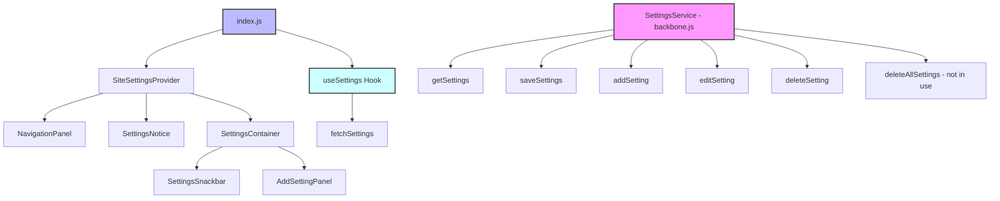

# High-Level System Diagram

## Components

### SiteSettingsProvider

Provides context for the entire settings module and manages state and actions related to settings.

### Settings (Main Component)

Entry point of the settings module. Contains the following sub-components:
- **NavigationPanel**: Displays categories for navigation.
- **SettingsNotice**: Displays error notices.
- **SettingsContainer**: Displays settings fields for the selected category.
- **AddSettingPanel**: Provides a form to add new settings.
- **SettingsSnackbar**: Displays success notices in a snackbar format.

### NavigationPanel

Displays categories for navigation and allows switching between different categories.

### SettingsNotice

Displays error notices.

### SettingsContainer

Displays settings fields for the selected category and allows editing, saving, and deleting settings. Dynamically renders appropriate field components.

### AddSettingPanel

Provides a form to add new settings.

### SettingsSnackbar

Displays success notices in a snackbar format.
